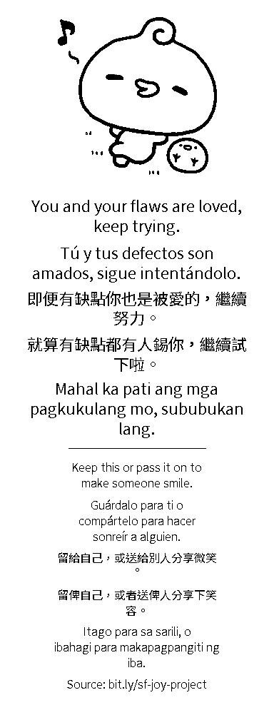

# Share Joy 🌉🖨️

Easily create handouts with positive affirmations to connect your community in these difficult times!

This Python tool generates affirmation strips for mini thermal printers in mutliple languages -- ensuring that neighbors who speak Spanish, Filipino (Tagalog), or Chinese (Mandarin / Cantonese) can receive a message in their native tongue, since many don't speak English

I originally made this to 1.) share positivity on the streets of San Francisco, and 2.) make it easier for others to do so as well

The script automates the assembly of text and graphics into a single printable .png strip with a single command, formatted specifically for the constraints of 58mm thermal paper (adjustable depending on your own printer).

## Setup & Usage
1. One-time installation

    a. Virtual Environment (optional) -- recommended for project separation (to not mess with any other code or requirements you have)
   ```
   python3 -m venv venv
   source venv/bin/activate
   ```

    b. Dependencies
   ```
   pip install -r requirements.txt
   ```

3. Add assets

   Add PNGs into the /graphics folder. Any image works fine, but simpler ones with darker lines are recommended for print clarity.
   
5. Run image generation

   ```
   python3 gen_strips.py
   ```

7. Print

   Transfer the outputted images in `/to_print` to your phone (i.e. via iMessage or messenger) from your computer, or send them directly to your thermal printer via BLE/USB.

   I recommend "text" over "graphic/image" settings generally, since thermal printers tend to show better that way

## Features
- Hyper-Local Translations: Includes colloquial Cantonese (using SF/Hong Kong phrasing) and Traditional Chinese characters.
- Low-Pressure CTA: Encourages people to either keep the message or pass it on, reducing the "pressure" of street interactions
- Asset Randomization: Pairs your affirmations with random graphics from a local folder.
- Open Source: No "sus" QR codes—just a clean link to the source so others can build on the project.

## Project Structure
```
.
├── gen_strips.py          # Main generation script
├── requirements.txt       # Dependencies (Pillow)
├── fonts/
│   └── static/            # Included Noto Sans TC (Standard CJK support included to support Mandarin and Cantonese)
├── graphics/              # Your custom icons/PNGs
└── to_print/              # Output folder for generated strips
```

## Contributing
If you'd like to add more languages common to the Bay Area (like Vietnamese or Arabic), feel free to submit a PR with the updated dictionary!

## TO-DO
- Add demo video of generation and printing
- Add example of extracting images

## License
MIT - Spread the love

## Example


[Link to full-sized example affirmation image generated from script](example.png)
